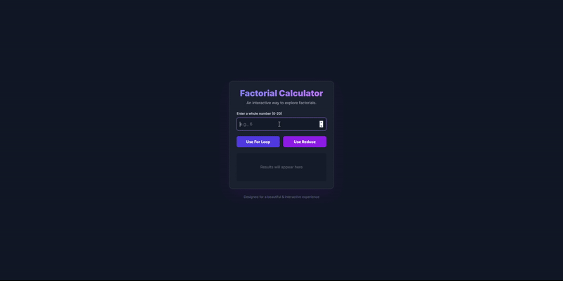

# Sigma Web Development - Exercise 11: Interactive Factorial Calculator

This repository contains my solution for Exercise 11 of the Sigma Web Development course. The project is a modern, interactive web application for calculating factorials, built with HTML, Tailwind CSS, and robust JavaScript.

---

## 🚀 Project Features

This project demonstrates a strong understanding of front-end development, from UI design to complex JavaScript logic.

-   **Modern UI/UX:** A beautiful "glassmorphism" interface built with Tailwind CSS, featuring smooth animations and a responsive design.
-   **Advanced JavaScript Logic:**
    -   **Dual Calculation Methods:** Users can choose to calculate factorials using either a `for loop` or the `Array.reduce()` method.
    -   **BigInt Support:** The code correctly uses `BigInt` to handle factorials of numbers larger than 20, preventing precision errors.
    -   **Robust Input Validation:** The calculator gracefully handles invalid inputs, negative numbers, and numbers that are too large, providing clear error messages.
-   **Interactive Experience:** The UI updates dynamically, featuring an animated result display and a detailed calculation breakdown (e.g., `6! = 6 × 5 × ...`).
-   **Clean Code:** The JavaScript is well-commented and organized into clear functions for maintainability.

## 🛠️ Tech Stack

-   **HTML5:** For the application structure.
-   **Tailwind CSS:** For all utility-first styling and layout.
-   **JavaScript (ES6+):** For all interactivity, DOM manipulation, and the core factorial calculation logic.

## 🙏 Acknowledgements

-   This project is part of the **Sigma Web Development Course** by **CodeWithHarry**.
